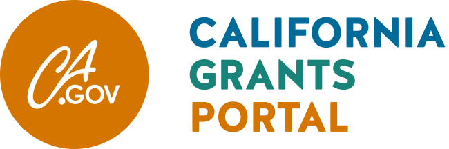

# 

> The California State Grants Plugin is the official WordPress plugin allowing you to manage your grant data within your own site running WordPress.

 

## Table of Contents
* [Overview](#overview)
* [Specifications](#specifications)
* [Requirements](#requirements)
* [Installation](#installation)
* [Support Level](#support-level)
* [Contributing](#contributing)

## Overview

The California Grants Portal, [grants.ca.gov](https://www.grants.ca.gov/), is managed and hosted by the California State Library. The [Grant Information Act of 2018](http://leginfo.legislature.ca.gov/faces/billNavClient.xhtml?bill_id=201720180AB2252) (Stats. 2018, Ch. 318) required the State Library to build one website by July 1, 2020, "that provides a centralized location ... to find state grant opportunities." State grantmaking agencies input and update their information into prescribed data fields to make all state grant opportunities searchable on [grants.ca.gov](https://www.grants.ca.gov/). The Grant Information Act requires state agencies to provide summaries of each of their grant or loan opportunities, including, among other items, information about how to apply and links that grantseekers can follow for more details. [AB132](https://leginfo.legislature.ca.gov/faces/billNavClient.xhtml?bill_id=202120220AB132) expanded the Grants Portal mission, requiring state grantmakers to submit post award data for all grants closing on or after July 1, 2022. This site was built in collaboration with our vendor [10up](https://10up.com/).

The California State Grants Plugin is the official WordPress plugin allowing the state agencies to submit their grant information and post award information via the plugin and manage the grant data within their own WordPress site.

### Policies Related to the California Grants Portal

* [Use Policy](https://www.grants.ca.gov/use-policy/)
* [Privacy Policy](https://www.grants.ca.gov/privacy-policy/)

## Specifications

Please follow the detailed instructions provided in the [State Grantmakers Guide](https://www.grants.ca.gov/state-grantmakers-guide/) **(state agencies must log in prior to accessing this link)**  to learn how to submit your grant opportunities to the Grants Portal.

## Requirements

- PHP 5.6+
- [WordPress](http://wordpress.org) 5.0+

### Browser Support

The plugin targets the following modern browsers:

* Desktop
    * Chrome | Latest version
    * Firefox | Latest version
    * Safari | Latest version
    * Edge | Latest version
* Mobile
    * Chrome, Android | Latest version
    * Chrome, iOS | Latest version
    * Safari, iOS | Latest version

## Installation

### Manual Installation from GitHub

1. Upload the entire `/CaliforniaStateGrantsPlugin` directory to the `/wp-content/plugins/` directory.
2. Activate California State Grants plugin through the 'Plugins' menu in WordPress.
3. Please follow the detailed instructions provided in the [State Grantmakers Guide](https://www.grants.ca.gov/state-grantmakers-guide/) **(state agencies must log in prior to accessing this link)**   to learn how to submit your grant opportunities to the Grants Portal.

### Installing the California State Grants plugin from the WordPress plugin store

1. Install and activate the [California State Grants plugin](https://wordpress.org/plugins/california-state-grants/) from the WordPress plugin store.
2. Please follow the detailed instructions provided in the [State Grantmakers Guide](https://www.grants.ca.gov/state-grantmakers-guide/) **(state agencies must log in prior to accessing this link)**  to learn how to submit your grant opportunities to the Grants Portal.

## Support Level

**Active:** CSL is actively working on this, and we expect to continue work for the foreseeable future including keeping tested up to the most recent version of WordPress. Bug reports, feature requests, questions, and pull requests are welcome.

## Contributing

This is a public project and we’d love to support any city or state interested in doing the same thing. If you have ideas for the grants.ca.gov, send us a pull request or contact us at <a href="mailto:CAgrantsportal@library.ca.gov">CAgrantsportal@library.ca.gov</a>.
